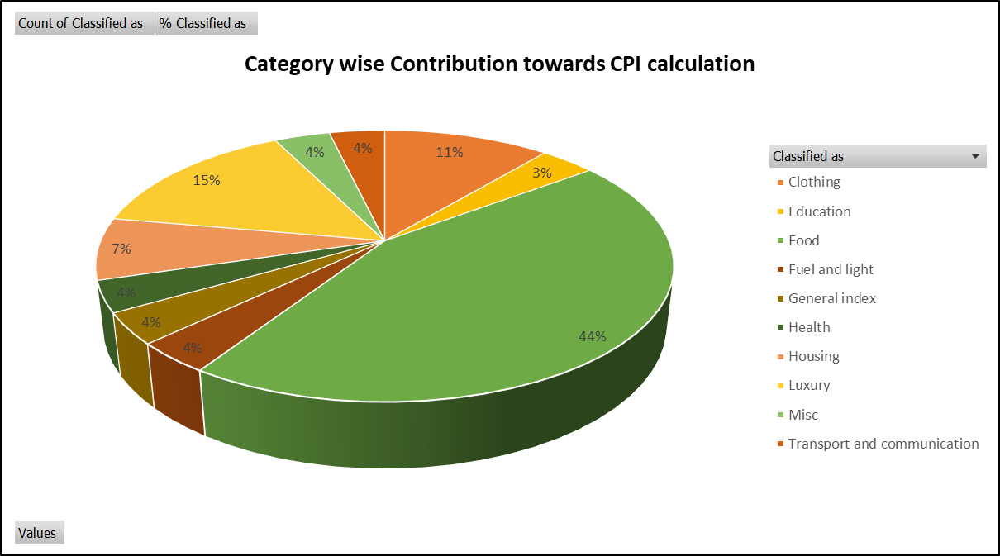
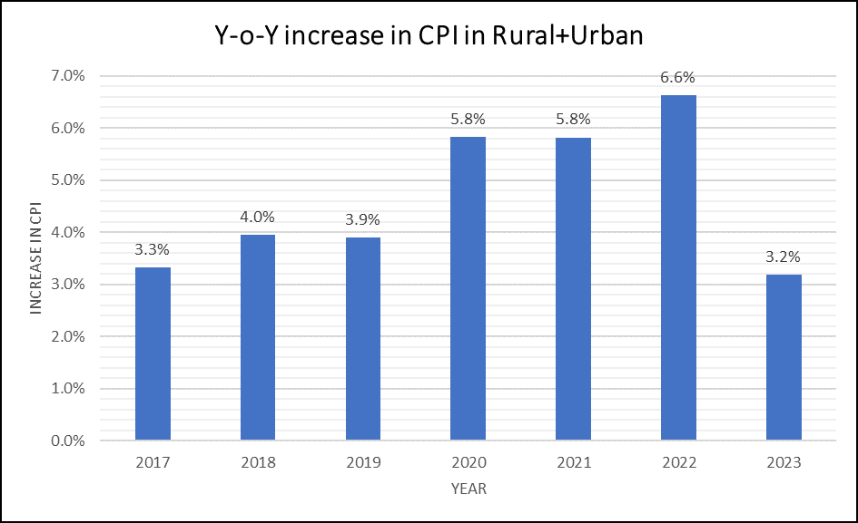
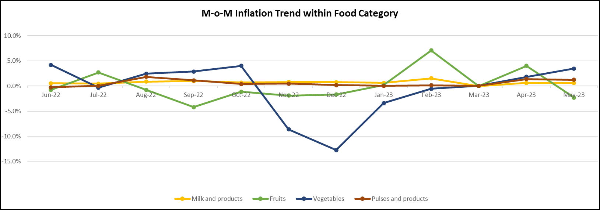
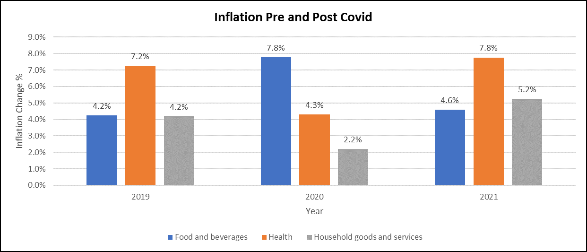
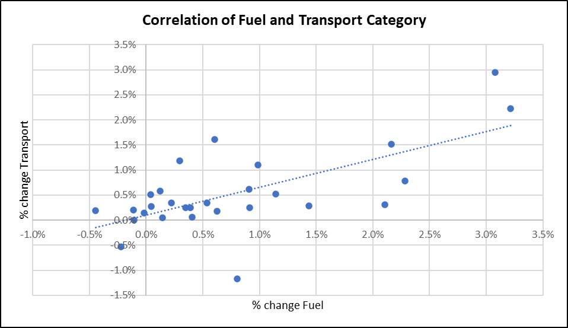
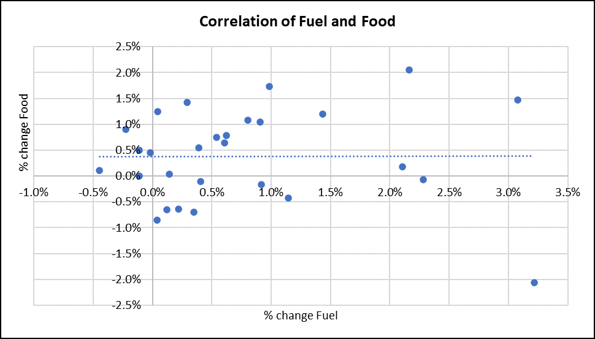

## India CPI Inflation Analysis

> **Portfolio Project | Microsoft Excel + Power Query**


## 📌 Project Overview

This project analyzes India's Consumer Price Index (CPI) data to identify inflation patterns across consumer sectors and CPI categories.

The analysis was built as an end-to-end **Excel + Power Query** workflow:

**Raw Data → Data Cleaning → Transformation → Classification → PivotTable Analysis → Visualization → Insights**

The project focuses on five analytical questions covering category-level CPI contribution, year-on-year inflation, food inflation movements, COVID-19 effects, and the relationship between fuel-price movements and selected CPI categories.

---

## 🎯 Business Questions

### 01. CPI Category Contribution
Which broader category has the highest contribution towards the CPI calculation?

### 02. Year-on-Year CPI Inflation
What is the year-on-year CPI inflation trend for the Rural + Urban sector, particularly from 2017 onward, and which year records the highest increase?

### 03. Food Inflation – Month-on-Month
How did the broader food category change month-on-month during the 12-month period ending May 2023, and which food sub-category contributed most to the observed movements?

### 04. COVID-19 Impact
How did the onset and progression of COVID-19 affect inflation in India (Mar 2020), particularly across food, healthcare and household/essential-service categories?

### 05. Imported Oil/Fuel Price Relationship
How are month-on-month fuel-price movements associated with selected CPI categories during 2021–2023?

---

# 🛠️ Tools & Techniques

| Tool / Technique | Application |
|---|---|
| **Microsoft Excel** | Analysis, PivotTables and visualizations |
| **Power Query** | Cleaning and transformation |
| **Data Classification** | Mapping detailed CPI items to broader buckets |
| **Unpivoting** | Converting category columns into an analysis-friendly structure |
| **PivotTables** | Aggregation and comparison |
| **YoY Analysis** | Annual inflation growth |
| **MoM Analysis** | Monthly inflation movement |
| **Correlation Analysis** | Fuel vs. selected CPI category relationships |
| **Charts / Dashboard** | Communicating findings |

---

# 🔄 Project Workflow

```text
                 RAW CPI DATA
                       │
                       ▼
              POWER QUERY EDITOR
                       │
             ┌─────────┴─────────┐
             │                   │
        Data Cleaning       Data Transformation
             │                   │
             └─────────┬─────────┘
                       ▼
               CPI UNPIVOT DATA
                       │
                       ▼
             BROADER CLASSIFICATION
                       │
                       ▼
                PIVOTTABLES
                       │
                       ▼
             ANALYSIS & CALCULATIONS
                       │
                       ▼
                VISUALIZATIONS
                       │
                       ▼
                 KEY INSIGHTS
```

---

# 🧹 Data Cleaning & Transformation

The raw CPI data was prepared in **Power Query Editor** before analysis.

### Main transformation steps

- Prepared the raw CPI table for analysis.
- Standardized the month field and corrected month text where required.
- Structured the sector, year and month fields.
- Unpivoted the detailed CPI category columns.
- Created an `Original Classification` field for the detailed CPI category.
- Created a `Classified as` field to group detailed categories into broader analytical buckets.
- Created a numeric month field to support chronological analysis.
- Loaded the transformed dataset into Excel for PivotTable and visualization work.

### Resulting analytical structure

The unpivoted data contains fields such as:

- Sector
- Year
- Month
- Original Classification
- CPI Value
- Classified as
- Month Number

This transformation makes the dataset much easier to filter, group and analyze using PivotTables.

---

# 📊 Analysis & Visualizations

## 01. Broader Category Contribution

**Question:** Which broader category has the highest contribution towards CPI calculation?



### Key Insight

**Food accounts for 44% of the classified observations**, making it the largest category in the displayed contribution analysis. Education accounts for approximately 3%.

---

## 02. Year-on-Year CPI Inflation Trend

**Question:** What is the year-on-year inflation trend for the Rural + Urban CPI basket from 2017 onward?



### Key Insights

- The Rural + Urban series records its highest year-on-year increase in the analyzed 2017–2023 period in **2022, at 6.6%**.
- As per research, the inflation peaked due to severe global supply shocks from the Russia - Ukraine war which spiked imported oil and food prices.

---

## 03. Month-on-Month Food Inflation

**Question:** How did food-category prices move month-on-month during June 2022–May 2023?



### Key Insights

- **February 2023** records the highest observed monthly inflation rate in the project analysis, at approximately **7.1%**, driven primarily by the Fruits category.
- **December 2022** records the lowest monthly movement, at approximately **-12.7%**, driven primarily by Vegetables.
- The analysis compares Vegetables, Fruits, Pulses and products, and Milk and products.

---

## 04. CPI Inflation Before & After COVID-19

**Question:** How did inflation change around the COVID-19 period across food, health and household goods/services?



### Key Insights

The project compares inflation movements before and after the 2020 COVID-19 period.

- Overall Shift: Pre-2020 average inflation across these categories stood at 5.2%, which then increased to 5.87% post-2020, showing a overall baseline rise in cost pressures.
- Food & Beverages: Experienced a temporary spike to 7.8% during the initial 2020 lockdown, but stabilized post-2020 at 4.6% (a slight +0.4% net increase over 2019 levels).
- Health Services: Saw a delayed but significant surge post-2020, climbing from 7.2% in 2019 to 7.8% in 2021 (a net increase of +0.6%).
- Household Goods & Services: Recorded the largest post-2020 shift, rising from 4.2% pre-pandemic up to 5.2% in 2021 (a net increase of +1.0%).

---

## 05. Fuel Price & Transport Relationship

**Question:** How strongly are fuel-price movements associated with selected CPI categories during 2021–2023?

  

### Key Insights

- Category **"Transport & Communication" has the strongest relationship with oil/fuel price fluctuations, with a positive correlation of 67%**. This indicates that increases in oil prices are generally associated with increases in inflation in this category. 
- Category **"Food" shows 0% correlation**, indicating no linear relationship with oil price changes in the analysed data.

> Correlation indicates the strength and direction of association between variables; it does not by itself establish causation.

---

# 📈 Key Findings at a Glance

| Analysis | Result |
|---|---|
| Largest category in current classification analysis | **Food – 44% of classified observations** |
| Highest Rural + Urban YoY increase, 2017–2023 | **2022 – 6.6%** |
| Highest food MoM movement in analyzed period | **Feb 2023 – ~7.1%** |
| Lowest food MoM movement in analyzed period | **Dec 2022 – ~-12.7%** |
| COVID-19 impact on selected CPI categories | Inflation increased from 5.2% pre-2020 to 5.87% post-2020 |
| Fuel ↔ Transport & Communication correlation | **67% positive** |
| Fuel ↔ Food correlation | **~0%** |

---

# 📁 Repository Structure

```text
india-cpi-inflation-analysis/
│
├── README.md
│
├── excel/
│   └── CPI_Inflation_Analysis.xlsx
│
├── Charts/
│   ├── insights-1.png
│   ├── insights-2.png
│   ├── insights-3.png
│   ├── insights-4.png
│   └── insights-5.png
│   └── insights-5_2.png
|

```

---

# 📚 Project Documentation

The original project brief and detailed Excel workflow are included in the repository.

- **[Excel Analysis Workbook](excel/CPI_Inflation_Analysis.xlsx)**
- **[Power Query Transformation Notes](power-query/data-cleaning-process.md)**
- **[Key Insights](insights/key-insights.md)**
- **[Project Documentation](documentation/CPI_Inflation_Study.pdf)**

---

# 💼 Skills Demonstrated

### Data Preparation
- Data Cleaning
- Data Transformation
- Power Query
- Data Restructuring
- Data Classification
- Unpivoting

### Data Analysis
- Exploratory Data Analysis
- PivotTable Analysis
- Year-on-Year Analysis
- Month-on-Month Analysis
- Percentage Change
- Correlation Analysis

### Data Visualization
- KPI / trend visualization
- Comparative charts
- Time-series visualization
- Correlation visualization
- Excel dashboarding

### Business Analytics
- Translating business questions into analytical questions
- Identifying trends and patterns
- Interpreting analytical results
- Communicating findings through visualizations

---

# 🔎 Reproducibility

To reproduce the analysis:

1. Open the Excel workbook.
2. Review the `Raw Data` sheet.
3. Follow the transformation workflow documented in `power-query/data-cleaning-process.md`.
4. Review the `Cleaned Data` and `CPI Unpivot` sheets.
5. Explore the `Insights 1` through `Insights 5` sheets.
6. Review the `Dashboard` for the consolidated visual analysis.

---

# ⚠️ Analytical Notes

- CPI is an index used to measure changes in the price level of a basket over time; CPI index values should not be interpreted as direct price levels.
- Percentage change is used for YoY and MoM inflation analysis.
- Correlation results describe association and should not be interpreted as proof of causation.
- The category-contribution visualization reflects the calculation implemented in the workbook; it is not presented as an official CPI expenditure-weight calculation.

---

# 👤 Author

**Prayag Dave**

GitHub: [@prayag-dave-01](https://github.com/prayag-dave-01)

---

## ⭐ Portfolio

This repository is part of a portfolio focused on building practical projects using data cleaning, analysis, visualization and business storytelling.

More projects will be added as the portfolio grows.
